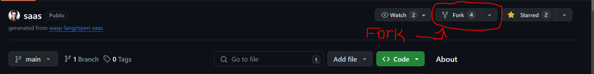
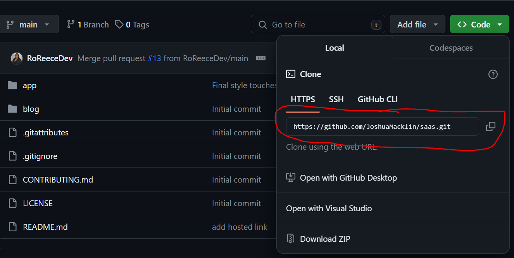

# Ascending Notes V.2

Hosted Site: [Ascending Notes V.2](https://ascend-notes-saas-app-client.fly.dev/)


## Getting Started ! 🎉

### Step 1: Setting up Wasp:

#### For Mac/Linux:

Install Wasp by running this command in your terminal:

```

curl -sSL https://get.wasp-lang.dev/installer.sh | sh

```

#### For Windows:

For Windows, install wasp requires a bit more work.

First, you need to install a Windoes Subsystem for Linux(or WSL)

A WSL allows developers on Windows systems to run a fully functional and native GNU/Linux environment. 

Check out this [Wasp WSL Documentation](https://wasp-lang.dev/blog/2023/11/21/guide-windows-development-wasp-wsl) for step-by-step information on how to install WSL on your Windows environment.

If you run into any issues, reach out in the [Wasp Discord](https://discord.gg/aCamt5wCpS) for help!


### Step 2: Fork and Clone Repo





In your terminal, cd into a folder of your choice and run command 

```

git clone https://github.com/<github-username>/<github-repo-name>.git

```
### Step 3: Installing Dependencies 

Open the cloned repo folder in your preferred IDE editor (We used [Visual Studio Code] (https://code.visualstudio.com/)!)

Open the terminal in your IDE editor and run these commands:

This command will take you to the app folder:


```

cd app

```

This command will install all the required dependencies for the application: 

```

npm install

```

You have now install all the dependencies! Gratz 🎉

### Step 4: Getting the App Running

#### Setting Up Database

In order to access the database you need to install Docker! 

If you don't have Docker, you can install it [here](https://www.docker.com/products/docker-desktop/)


After installing Docker, pleae follow the OpenSaas documentation on how to set up the database [here](https://docs.opensaas.sh/start/getting-started/#start-your-db)


#### Starting App

Please follow the OpenSaas documentation for [starting the app](https://docs.opensaas.sh/start/getting-started/#start-your-db)


## Understaning the Note App


## OpenSaaS Template Info


https://github.com/wasp-lang/open-saas/assets/70215737/5ff289b1-12b9-4b46-aa90-a6a3122de93e


This template is:

1. fully open-source
2. completely free to use and distribute
3. comes with a ton of features out of the box!
4. focused on free, open-source services, where possible

🧑‍💻 Check it out in action here: [OpenSaaS.sh](https://opensaas.sh)  
📚 Check out the Docs here: [Open SaaS Docs](https://docs.opensaas.sh)

## What's inside?

The template itself is built on top of some very powerful tools and frameworks, including:

- 🐝 [Wasp](https://wasp-lang.dev) - a full-stack React, NodeJS, Prisma framework with superpowers
- 🚀 [Astro](https://starlight.astro.build/) - Astro's lightweight "Starlight" template for documentation and blog
- 💸 [Stripe](https://stripe.com) - for products and payments
- 📈 [Plausible](https://plausible.io) or [Google](https://analytics.google.com/) Analytics
- 🤖 [OpenAI](https://openai.com) - OpenAI API integrated into the app or [Replicate](https://replicate.com/) (coming soon 👀)
- 📦 [AWS S3](https://aws.amazon.com/s3/) - for file uploads
- 📧 [SendGrid](https://sendgrid.com), [MailGun](https://mailgun.com), or SMTP - for email sending
- 💅 [TailwindCSS](https://tailwindcss.com) - for styling
- 🧑‍💼 [TailAdmin](https://tailadmin.com/) - admin dashboard & components for TailwindCSS

Because we're using Wasp as the full-stack framework, we can leverage a lot of its features to build our SaaS in record time, including:

- 🔐 [Full-stack Authentication](https://wasp-lang.dev/docs/auth/overview) - Email verified + social Auth in a few lines of code.
- ⛑ [End-to-end Type Safety](https://wasp-lang.dev/docs/data-model/operations/overview) - Type your backend functions and get inferred types on the front-end automatically, without the need to install or configure any third-party libraries. Oh, and type-safe Links, too!
- 🤖 [Jobs](https://wasp-lang.dev/docs/advanced/jobs) - Run cron jobs in the background or set up queues simply by defining a function in the config file.
- 🚀 [One-command Deploy](https://wasp-lang.dev/docs/advanced/deployment/overview) - Easily deploy via the CLI to [Fly.io](https://fly.io), or to other providers like [Railway](https://railway.app) and [Netlify](https://netlify.com).

You also get access to Wasp's diverse, helpful community if you get stuck or need help.
- 🤝 [Wasp Discord](https://discord.gg/aCamt5wCpS)


Note that we've tried to get as many of the core features of a SaaS app into this template as possible, but there still might be some missing features or functionality.

We could always use some help tying up loose ends, so consider [contributing](https://github.com/wasp-lang/open-saas/blob/main/CONTRIBUTING.md)!
